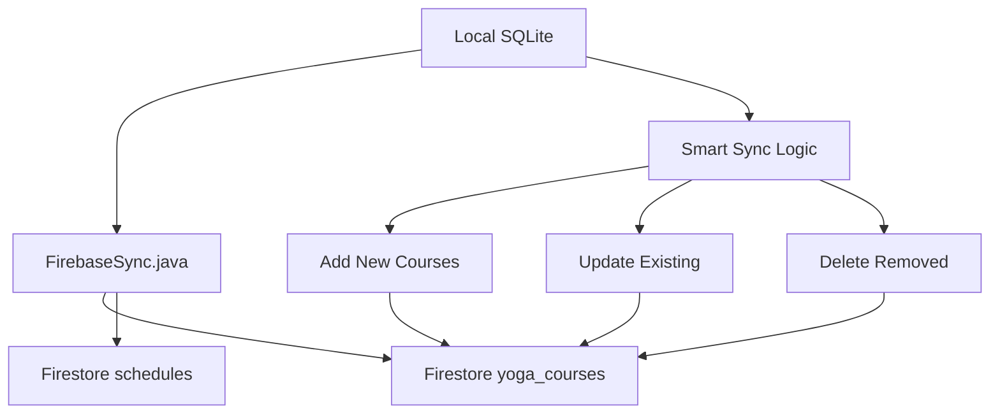
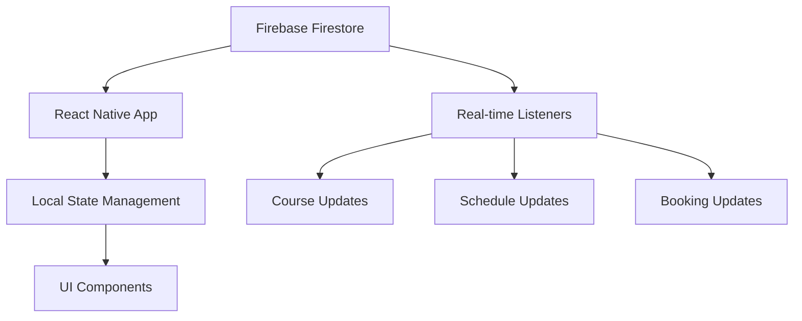

# Database Entity Relationship Diagram (ERD)

## Yoga Studio Management System

## Overview

This document provides a comprehensive Entity Relationship Diagram for the Yoga Studio Management System, covering both the local SQLite database (YogaAdmin) and the Firebase Firestore collections (YogaCustomer).

---

## 1. Local SQLite Database (YogaAdmin)

### Database Schema

```sql
-- YogaCourse Table (Parent Entity)
CREATE TABLE yoga_courses (
    id INTEGER PRIMARY KEY AUTOINCREMENT,
    dayOfWeek VARCHAR(10) NOT NULL,    -- Monday, Tuesday, etc.
    time VARCHAR(5) NOT NULL,           -- 10:00, 11:00, etc.
    capacity INTEGER NOT NULL,          -- Number of persons
    duration INTEGER NOT NULL,          -- Duration in minutes
    price DECIMAL(10,2) NOT NULL,      -- Price per class
    type VARCHAR(50) NOT NULL,          -- Flow Yoga, Aerial Yoga, etc.
    description TEXT                    -- Optional description
);

-- Schedule Table (Child Entity)
CREATE TABLE schedules (
    id INTEGER PRIMARY KEY AUTOINCREMENT,
    courseId INTEGER NOT NULL,          -- Foreign key to yoga_courses
    date VARCHAR(10) NOT NULL,          -- ISO format yyyy-MM-dd
    teacher VARCHAR(100),               -- Teacher name
    comments TEXT,                      -- Additional comments
    FOREIGN KEY (courseId) REFERENCES yoga_courses(id) ON DELETE CASCADE
);
```

### Entity Relationship Diagram

```
┌─────────────────────────────────────────────────────────────────┐
│                        YOGA_COURSES                            │
├─────────────────────────────────────────────────────────────────┤
│ PK: id (INTEGER, AUTOINCREMENT)                               │
│     dayOfWeek (VARCHAR(10), NOT NULL)                         │
│     time (VARCHAR(5), NOT NULL)                               │
│     capacity (INTEGER, NOT NULL)                              │
│     duration (INTEGER, NOT NULL)                              │
│     price (DECIMAL(10,2), NOT NULL)                           │
│     type (VARCHAR(50), NOT NULL)                              │
│     description (TEXT, NULLABLE)                               │
└─────────────────────────────────────────────────────────────────┘
                                │
                                │ 1:N Relationship
                                │ (One course can have many schedules)
                                │ ON DELETE CASCADE
                                ▼
┌─────────────────────────────────────────────────────────────────┐
│                         SCHEDULES                              │
├─────────────────────────────────────────────────────────────────┤
│ PK: id (INTEGER, AUTOINCREMENT)                               │
│ FK: courseId (INTEGER, NOT NULL) → yoga_courses.id           │
│     date (VARCHAR(10), NOT NULL)                             │
│     teacher (VARCHAR(100), NULLABLE)                          │
│     comments (TEXT, NULLABLE)                                 │
└─────────────────────────────────────────────────────────────────┘
```

### Relationship Details

**YogaCourse ←→ Schedule (1:N)**

- **Cardinality**: One-to-Many
- **Description**: One yoga course can have multiple schedule instances
- **Foreign Key**: `schedules.courseId` references `yoga_courses.id`
- **Cascade**: When a course is deleted, all related schedules are automatically deleted
- **Business Logic**:
  - A course defines the template (type, time, capacity, price)
  - A schedule defines a specific instance (date, teacher, comments)

---

## 2. Firebase Firestore Collections (YogaCustomer)

### Collection Structure

```javascript
// Collection: yoga_courses (mirrors local YogaCourse entity)
{
  id: "auto-generated",
  dayOfWeek: "Monday",
  time: "10:00",
  capacity: 20,
  duration: 60,
  price: 15.00,
  type: "Flow Yoga",
  description: "Dynamic flow sequence",
  lastUpdated: Timestamp
}

// Collection: schedules (mirrors local Schedule entity)
{
  id: "auto-generated",
  courseId: "reference-to-yoga_courses",
  date: "2024-01-15",
  teacher: "Sarah Johnson",
  comments: "Special session for beginners"
}

// Collection: users (user profiles)
{
  id: "user-uid-from-firebase-auth",
  email: "user@example.com",
  displayName: "John Doe",
  phoneNumber: "+1234567890",
  photoURL: "https://...",
  preferences: {
    notifications: true,
    newsletter: false
  },
  bookings: ["booking-id-1", "booking-id-2"],
  createdAt: Timestamp,
  updatedAt: Timestamp
}

// Collection: shoppingCart (cart items)
{
  id: "auto-generated",
  userId: "user-uid",
  courseId: "reference-to-yoga_courses",
  instanceId: "reference-to-schedules",
  className: "Flow Yoga",
  classType: "Flow Yoga",
  teacher: "Sarah Johnson",
  date: "2024-01-15",
  time: "10:00",
  duration: 60,
  price: 15.00,
  quantity: 1,
  dayOfWeek: "Monday",
  capacity: 20,
  description: "Dynamic flow sequence",
  comments: "Special session for beginners",
  addedAt: Timestamp,
  status: "pending" // pending, booked, cancelled
}

// Collection: bookings (confirmed bookings)
{
  id: "auto-generated",
  userId: "user-uid",
  userEmail: "user@example.com",
  items: [
    {
      courseId: "reference-to-yoga_courses",
      instanceId: "reference-to-schedules",
      className: "Flow Yoga",
      classType: "Flow Yoga",
      teacher: "Sarah Johnson",
      date: "2024-01-15",
      time: "10:00",
      duration: 60,
      price: 15.00,
      quantity: 1,
      dayOfWeek: "Monday",
      description: "Dynamic flow sequence",
      comments: "Special session for beginners"
    }
  ],
  summary: {
    totalAmount: 15.00,
    totalItems: 1,
    totalQuantity: 1
  },
  status: "confirmed", // confirmed, cancelled, completed
  bookingDate: Timestamp,
  paymentDetails: null, // Future payment integration
  createdAt: Timestamp,
  updatedAt: Timestamp
}
```

### Firestore ERD

```
┌─────────────────────────────────────────────────────────────────┐
│                      YOGA_COURSES                              │
│                    (Collection)                                │
├─────────────────────────────────────────────────────────────────┤
│ Document ID: auto-generated                                   │
│ Fields:                                                       │
│   - dayOfWeek: string                                        │
│   - time: string                                             │
│   - capacity: number                                         │
│   - duration: number                                         │
│   - price: number                                            │
│   - type: string                                             │
│   - description: string                                      │
│   - lastUpdated: timestamp                                   │
└─────────────────────────────────────────────────────────────────┘
                                │
                                │ 1:N
                                ▼
┌─────────────────────────────────────────────────────────────────┐
│                       SCHEDULES                               │
│                     (Collection)                              │
├─────────────────────────────────────────────────────────────────┤
│ Document ID: auto-generated                                   │
│ Fields:                                                       │
│   - courseId: string (reference)                             │
│   - date: string                                             │
│   - teacher: string                                          │
│   - comments: string                                         │
└─────────────────────────────────────────────────────────────────┘
                                │
                                │ 1:N
                                ▼
┌─────────────────────────────────────────────────────────────────┐
│                    SHOPPING_CART                              │
│                     (Collection)                              │
├─────────────────────────────────────────────────────────────────┤
│ Document ID: auto-generated                                   │
│ Fields:                                                       │
│   - userId: string (reference)                               │
│   - courseId: string (reference)                             │
│   - instanceId: string (reference)                           │
│   - className: string                                        │
│   - classType: string                                        │
│   - teacher: string                                          │
│   - date: string                                             │
│   - time: string                                             │
│   - duration: number                                         │
│   - price: number                                            │
│   - quantity: number                                         │
│   - dayOfWeek: string                                        │
│   - capacity: number                                         │
│   - description: string                                      │
│   - comments: string                                         │
│   - addedAt: timestamp                                       │
│   - status: string                                           │
└─────────────────────────────────────────────────────────────────┘
                                │
                                │ 1:N
                                ▼
┌─────────────────────────────────────────────────────────────────┐
│                       BOOKINGS                                │
│                     (Collection)                              │
├─────────────────────────────────────────────────────────────────┤
│ Document ID: auto-generated                                   │
│ Fields:                                                       │
│   - userId: string (reference)                               │
│   - userEmail: string                                        │
│   - items: array of objects                                  │
│   - summary: object                                          │
│   - status: string                                           │
│   - bookingDate: timestamp                                   │
│   - paymentDetails: object                                   │
│   - createdAt: timestamp                                     │
│   - updatedAt: timestamp                                     │
└─────────────────────────────────────────────────────────────────┘

┌─────────────────────────────────────────────────────────────────┐
│                        USERS                                  │
│                     (Collection)                              │
├─────────────────────────────────────────────────────────────────┤
│ Document ID: user-uid (from Firebase Auth)                   │
│ Fields:                                                       │
│   - email: string                                            │
│   - displayName: string                                      │
│   - phoneNumber: string                                      │
│   - photoURL: string                                         │
│   - preferences: object                                      │
│   - bookings: array of strings                               │
│   - createdAt: timestamp                                     │
│   - updatedAt: timestamp                                     │
└─────────────────────────────────────────────────────────────────┘
```

### Relationship Mapping

**1. YogaCourse ←→ Schedule (1:N)**

- **Local**: Foreign key relationship with CASCADE delete
- **Firestore**: Document references with manual cleanup
- **Sync**: Bidirectional synchronization between local and cloud

**2. User ←→ ShoppingCart (1:N)**

- **Firestore**: User ID as foreign key in cart items
- **Status**: Cart items have status (pending, booked, cancelled)
- **Business Logic**: Users can have multiple cart items

**3. User ←→ Booking (1:N)**

- **Firestore**: User ID as foreign key in bookings
- **Items**: Booking contains array of cart items
- **Summary**: Booking includes total amount and item count

**4. Schedule ←→ ShoppingCart (1:N)**

- **Firestore**: Schedule ID referenced in cart items
- **Business Logic**: Multiple users can add same schedule to cart

**5. YogaCourse ←→ ShoppingCart (1:N)**

- **Firestore**: Course ID referenced in cart items
- **Business Logic**: Course template information stored in cart

---

## 3. Data Flow and Synchronization

### Local to Cloud Sync (YogaAdmin → Firebase)



### Cloud to Local Sync (Firebase → YogaCustomer)



---

## 4. Data Validation and Constraints

### Local SQLite Constraints

```sql
-- YogaCourse Constraints
ALTER TABLE yoga_courses ADD CONSTRAINT chk_capacity
    CHECK (capacity > 0 AND capacity <= 100);

ALTER TABLE yoga_courses ADD CONSTRAINT chk_duration
    CHECK (duration > 0 AND duration <= 300);

ALTER TABLE yoga_courses ADD CONSTRAINT chk_price
    CHECK (price >= 0);

ALTER TABLE yoga_courses ADD CONSTRAINT chk_dayOfWeek
    CHECK (dayOfWeek IN ('Monday', 'Tuesday', 'Wednesday', 'Thursday', 'Friday', 'Saturday', 'Sunday'));

-- Schedule Constraints
ALTER TABLE schedules ADD CONSTRAINT chk_date_format
    CHECK (date LIKE '____-__-__');

ALTER TABLE schedules ADD CONSTRAINT fk_courseId
    FOREIGN KEY (courseId) REFERENCES yoga_courses(id) ON DELETE CASCADE;
```

### Firestore Security Rules

```javascript
rules_version = '2';
service cloud.firestore {
  match /databases/{database}/documents {
    // Users can only access their own data
    match /users/{userId} {
      allow read, write: if request.auth != null && request.auth.uid == userId;
    }

    // Anyone can read yoga courses and schedules
    match /yoga_courses/{courseId} {
      allow read: if true;
      allow write: if false; // Only admin app can write
    }

    match /schedules/{scheduleId} {
      allow read: if true;
      allow write: if false; // Only admin app can write
    }

    // Users can manage their own cart items
    match /shoppingCart/{cartId} {
      allow read, write: if request.auth != null &&
        request.auth.uid == resource.data.userId;
    }

    // Users can manage their own bookings
    match /bookings/{bookingId} {
      allow read, write: if request.auth != null &&
        request.auth.uid == resource.data.userId;
    }
  }
}
```

---

## 5. Indexing Strategy

### Local SQLite Indexes

```sql
-- Performance indexes for common queries
CREATE INDEX idx_yoga_courses_type ON yoga_courses(type);
CREATE INDEX idx_yoga_courses_day_time ON yoga_courses(dayOfWeek, time);
CREATE INDEX idx_schedules_courseId ON schedules(courseId);
CREATE INDEX idx_schedules_date ON schedules(date);
CREATE INDEX idx_schedules_teacher ON schedules(teacher);
```

### Firestore Indexes

```javascript
// Composite indexes for complex queries
{
  "indexes": [
    {
      "collectionGroup": "yoga_courses",
      "queryScope": "COLLECTION",
      "fields": [
        { "fieldPath": "dayOfWeek", "order": "ASCENDING" },
        { "fieldPath": "time", "order": "ASCENDING" }
      ]
    },
    {
      "collectionGroup": "schedules",
      "queryScope": "COLLECTION",
      "fields": [
        { "fieldPath": "courseId", "order": "ASCENDING" },
        { "fieldPath": "date", "order": "ASCENDING" }
      ]
    },
    {
      "collectionGroup": "shoppingCart",
      "queryScope": "COLLECTION",
      "fields": [
        { "fieldPath": "userId", "order": "ASCENDING" },
        { "fieldPath": "status", "order": "ASCENDING" },
        { "fieldPath": "addedAt", "order": "DESCENDING" }
      ]
    },
    {
      "collectionGroup": "bookings",
      "queryScope": "COLLECTION",
      "fields": [
        { "fieldPath": "userId", "order": "ASCENDING" },
        { "fieldPath": "bookingDate", "order": "DESCENDING" }
      ]
    }
  ]
}
```

---

## 6. Data Migration and Backup

### Local Database Migration

```java
// Room Database Migration Strategy
@Database(
    entities = {YogaCourse.class, Schedule.class},
    version = 1,
    exportSchema = true
)
public abstract class AppDatabase extends RoomDatabase {
    // Migration from version 1 to 2 (if needed)
    static final Migration MIGRATION_1_2 = new Migration(1, 2) {
        @Override
        public void migrate(SupportSQLiteDatabase database) {
            // Add new columns or modify existing ones
            database.execSQL("ALTER TABLE yoga_courses ADD COLUMN lastUpdated TEXT");
        }
    };
}
```

### Firestore Backup Strategy

```javascript
// Automated backup to Cloud Storage
exports.backupFirestore = functions.pubsub
  .schedule("every 24 hours")
  .onRun(async (context) => {
    const collections = [
      "yoga_courses",
      "schedules",
      "users",
      "bookings",
      "shoppingCart",
    ];

    for (const collection of collections) {
      const snapshot = await admin.firestore().collection(collection).get();
      const data = snapshot.docs.map((doc) => ({
        id: doc.id,
        ...doc.data(),
      }));

      // Save to Cloud Storage
      await admin
        .storage()
        .bucket()
        .file(`backups/${collection}_${Date.now()}.json`)
        .save(JSON.stringify(data, null, 2));
    }
  });
```

---

## 7. Performance Considerations

### Local Database Optimization

1. **Indexing**: Strategic indexes on frequently queried columns
2. **Query Optimization**: Use prepared statements and limit result sets
3. **Background Operations**: All database operations on background threads
4. **Memory Management**: Proper cursor management and resource cleanup

### Firestore Optimization

1. **Pagination**: Use `limit()` and `startAfter()` for large datasets
2. **Real-time Listeners**: Efficient listener management and cleanup
3. **Offline Persistence**: Enable offline caching for better UX
4. **Batch Operations**: Use batch writes for multiple operations
5. **Security Rules**: Optimize security rules for performance

---

## 8. Scalability Considerations

### Horizontal Scaling

1. **Firestore**: Automatic scaling with Google Cloud
2. **Local Database**: Room database with efficient query patterns
3. **Caching**: Implement caching strategies for frequently accessed data
4. **Load Balancing**: Firebase handles load balancing automatically

### Data Growth Management

1. **Archiving**: Archive old bookings and schedules
2. **Partitioning**: Consider date-based partitioning for large datasets
3. **Cleanup**: Regular cleanup of abandoned cart items
4. **Monitoring**: Implement database performance monitoring

---

This ERD provides a comprehensive view of the database architecture for the Yoga Studio Management System, covering both local and cloud data structures, relationships, constraints, and optimization strategies.
